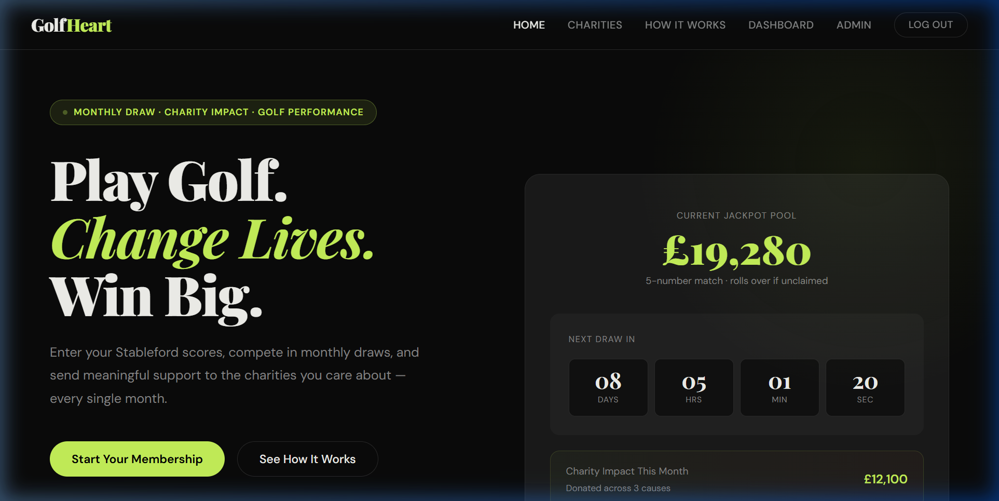
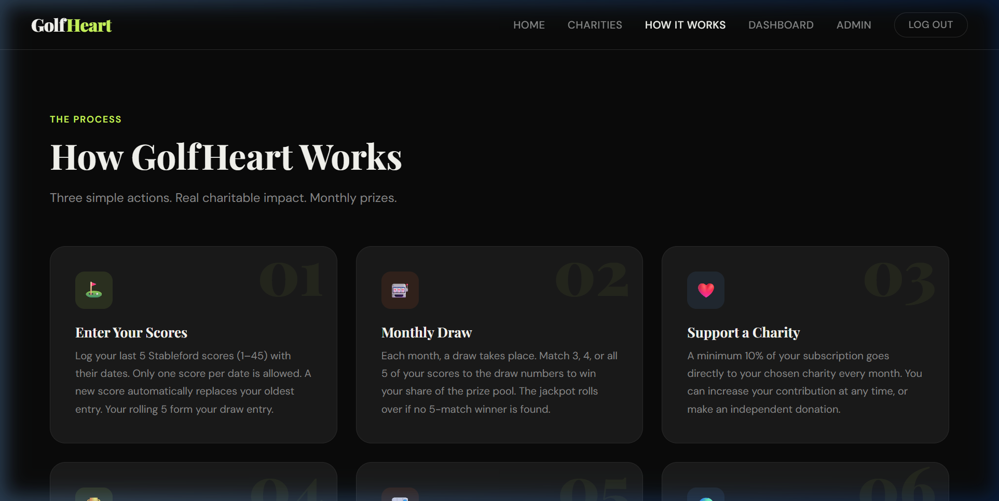
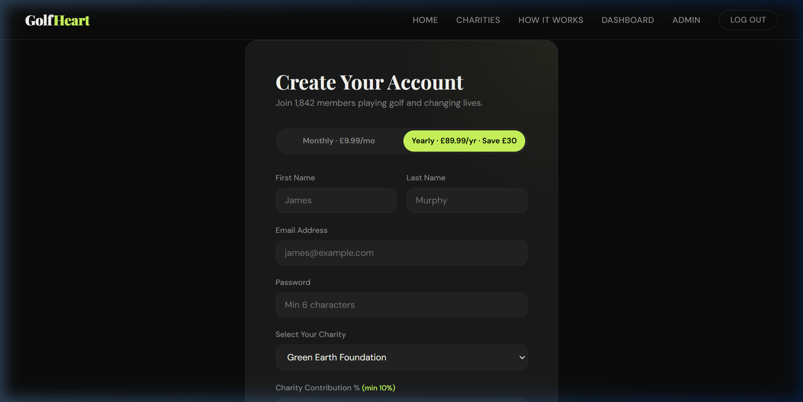
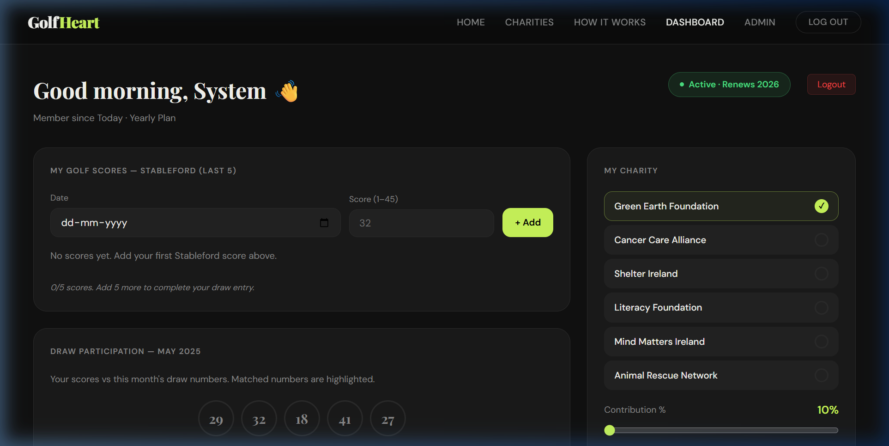
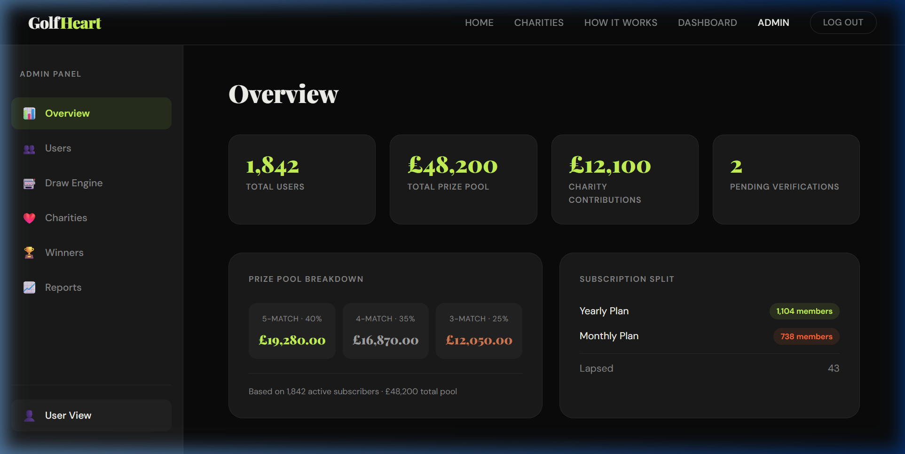

# GolfHeart 🏌️

> **Play Golf. Change Lives. Win Big.**

A full-stack web platform combining golf performance tracking, charity fundraising, and a monthly prize draw engine.

---

## 📸 Screenshots

### 🏠 Home Page


### ℹ️ How It Works


### 📝 Sign Up Page


### 📊 User Dashboard


### 🛡️ Admin Panel


---

## 🚀 Quick Start

```bash
# Install dependencies
npm install
cd server && npm install && cd ..

# Run app (frontend + backend)
npm run fullstack
```

> Opens at **http://localhost:5173**

---

## 🔑 Login Credentials

| Role  | Email                 | Password   |
|-------|-----------------------|------------|
| Admin | `admin@golfheart.com` | `admin123` |
| User  | *Sign up as new user* | *Any*      |

---

## 🔧 Tech Stack

| Layer      | Technology                          |
|------------|-------------------------------------|
| Frontend   | React 18 + Vite                     |
| Backend    | Node.js + Express                   |
| Database   | MongoDB (In-Memory, zero setup)     |
| Auth       | JWT + bcryptjs                      |
| File Upload| Multer                              |
| Styling    | Plain CSS                           |

---

*Built for the Digital Heroes PRD — Full Stack Trainee Selection*
